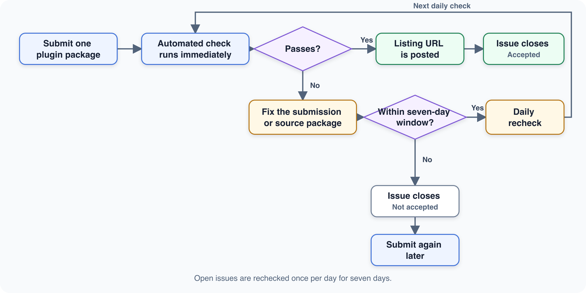

<h1 align="center">
  
</h1>

  <a href="https://dsh.directory">Browse DSH Directory</a> ·
  <a href="https://github.com/alexchenzl/dsh-plugin-directory/issues/new?template=plugin-submission.yml">Submit a plugin</a> ·
  <a href="CONTRIBUTING.md">Contributing guide</a>

## About

DSH Plugin Directory gives the DeepSeek Harness community a central place to discover plugins and gives plugin authors a consistent path to share their work. This repository is the submission intake for that directory: it collects submissions and validates their basic structure. Any accepted-record files in this repository are exports for reference only. This repository does not host plugin code or third-party binaries.

Plugin authors are encouraged to submit their work here. Accepted submissions receive more prominent placement in the directory, helping users discover them more easily.

## How it works

Plugin authors and community members submit **one plugin package per issue** through the GitHub issue form.

| Required field | What to provide |
| --- | --- |
| Package URL | The exact GitHub URL of the package directory on the repository's current default branch: either the repository root or a `/tree/<branch>/<path>` URL for a nested package. |
| Primary category | One category from the Harness category list. |
| Description | One factual line describing the plugin's main capability. |
| Install command | A single-line command copied from the plugin's own documentation. |

Each check reads the issue's current values and validates the submitted information and package structure. The upstream repository remains the source of truth for the plugin itself.

## What can pass verification

Verification is intended for publicly accessible, installable DSH Profile Bundles.

| Rule | Passes verification | Does not pass |
| --- | --- | --- |
| Repository access | The repository is public. | The repository is private or inaccessible. |
| Package URL | Points to the exact package directory on the current default branch. | Points to a file, the wrong directory, or a non-default branch. |
| Package manifest | `package.json` is directly inside the submitted directory. | `package.json` is missing or located elsewhere. |
| Bundle declaration | `package.json` declares `dsh.bundle.patch`. | The package declares only `dsh.client` or no bundle patch. |
| Patch file | The declared patch file exists inside the submitted package directory. | The declared patch file is missing or outside the package directory. |
| Listing details | Includes a valid category, factual one-line description, and documented single-line install command. | Any required value is missing, invalid, promotional, or undocumented. |

A package that declares only `dsh.client` is not an installable Profile Bundle and cannot pass. These checks verify structure and listing information, not the plugin's runtime behavior, quality, compatibility, or security. See [CONTRIBUTING.md](CONTRIBUTING.md) for the complete submission requirements.

## Trust and safety

Directory checks establish that a submission has the expected basic structure; they do not execute the plugin or its installation command, and install commands are stored and rendered only as inert text. Inclusion is not a security audit, compatibility guarantee, runtime test, or endorsement, and a listing does not imply safety, trust, ownership, or approval — submitting a repository does not establish ownership.

Before installing a third-party plugin, review its source code, permissions, dependencies, license, and upstream documentation.

## Submit Your Plugin

Built a plugin for DeepSeek Harness? [Submit your plugin](https://github.com/alexchenzl/dsh-plugin-directory/issues/new?template=plugin-submission.yml) to share it with the community and help more users discover your work.

Review the [contributing guide](CONTRIBUTING.md) for eligibility rules, submission requirements, corrections, and pull request guidance.

## License

Repository code and documentation are available under the [Apache License 2.0](LICENSE). Third-party plugins remain subject to their own licenses.
